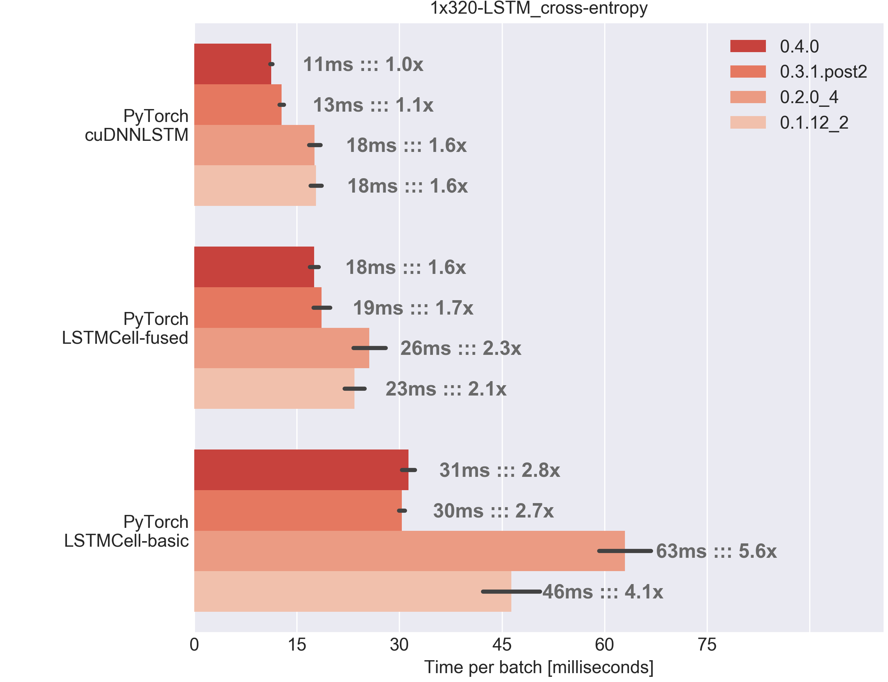
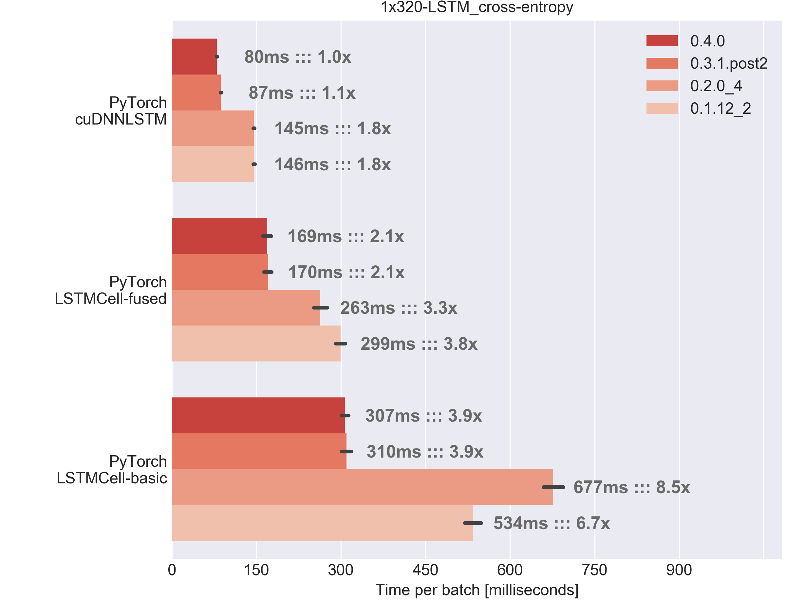
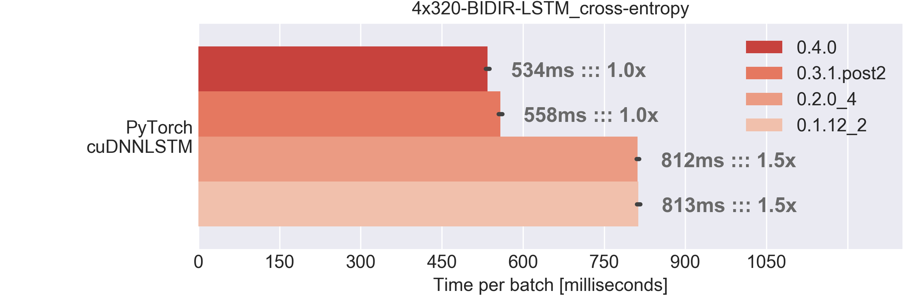
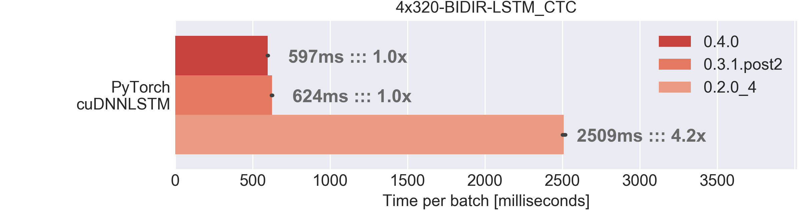

# PyTorch comparison
- PyTorch 0.1 to 0.4 version comparison
- LSTM implementations by cuDNN, fused kernels and naive approaches
- Fixed sequence-length data with cross-entropy loss and variable sequence-length data with CTC loss
- Input sizes 64x100x123 and 32x1000x123 (batch size x time steps x channels)
- Network sizes 1x320 and 4x320 (number of layers x number of LSTM units)

## Library versions
Library | Version | Release |Backend | cuda | cuDNN
-|-|-|-|-|-
PyTorch | 0.4.0 | [April 2018](https://github.com/PyTorch/PyTorch/releases/tag/v0.4.0) | - | 9.0 | 7102
PyTorch | 0.3.1post2 | [February 2018](https://github.com/PyTorch/PyTorch/releases/tag/v0.3.1) | - | 8.0 | 7005
PyTorch | 0.2.0_4 | [August 2017](https://github.com/PyTorch/PyTorch/releases/tag/v0.2.0) | - | 8.0 | 6021
PyTorch | 0.1.12_2 | [April 2018](https://github.com/PyTorch/PyTorch/releases/tag/v0.1.12) | - | 8.0 | 6021

## LSTM implementations

Library | Name | Details
-|-|-
PyTorch | [`LSTMCell-basic`](https://github.com/stefbraun/rnn_benchmarks/blob/master/1x320-LSTM/lib_PyTorchLSTM.py) | Custom code, pure PyTorch implementation, easy to modify. Loop over time with Python `for` loop
PyTorch | [`LSTMCell-fused`](http://PyTorch.org/docs/stable/nn.html?highlight=lstmcell#torch.nn.LSTMCell) | LSTM with optimized kernel for single time steps. Loop over time with Python `for` loop
PyTorch |[`cuDNNLSTM`](http://PyTorch.org/docs/stable/nn.html?highlight=lstm#torch.nn.LSTM) | Wrapper to cuDNN LSTM implementation

## Loss functions and input data
The loss functions are varied with the input data:
1. Cross-entropy for fixed sequence length data
  - default implementation from PyTorch
2. Connectionist Temporal Classification (CTC) for variable sequence length data
  - warp_ctc for [PyTorch](https://github.com/SeanNaren/warp-ctc)

Benchmark name | Layers x LSTM units | # Classes or output units | Loss | Inputsize [NxTxC] 1 | Sequence length | Labels per sample| Comment
-|-|-|-|-|-|-|-
1x320/CE-short | 1x320 unidirectional | 10 Dense | cross entropy | 64x100x123 | fixed [100] | 1 |  Real world test Dimensions are similar to isolated digit recognition on the TIDIGITS dataset2
1x320/CE-long | 1x320 unidirectional | 10 Dense | cross entropy | 32x1000x123 | fixed [1000] | 1 | Synthetic test
4x320/CE-long | 4x320 bidirectional | 10 Dense | cross entropy | 32x1000x123 | fixed [1000] | 1 | Synthetic test
4x320/CTC-long | 4x320 bidirectional | 59 Dense | CTC| 32x1000x123 | variable [500..1000] | 100 |  Real-world test  Dimensions are similar to continuous speech recognition on the WSJ dataset3
<!--
Loss | Input size [NxTxC]1 |  Sequence length |  Classes | Labels per sample | Comment
-|-|-|-|-
Cross-entropy | 64x100x123| fixed [100] | 10 | 1 | Real world test Dimensions are similar to isolated digit recognition on the TIDIGITS dataset1
Cross-entropy | 32x1000x123| fixed [1000] | 10 | 1 | Synthetic test
CTC | 32x1000x123| variable [500..1000] | 59 | 100 | Real-world test  Dimensions are similar to continuous speech recognition on the WSJ dataset2 -->
1N=number of samples, T=time-steps, C=feature channels 
2ASR-task on TIDIGITS/isolated digit recognition, default training set (0.7 hours of speech): 123-
dimensional filterbank features with 100fps, average sequence length of 98, alphabet size of 10 digits and
1 label per sample 
3ASR-task on WSJ/continuous speech recognition, pre-processing with [EESEN](https://github.com/srvk/eesen) on training subset
si-284 (81h of speech): 123-dimensional filterbank features with 100fps, average sequence length 783, alphabet
size of 59 characters and average number of characters per sample 102
## Results
- Xeon-W 2195 CPU, GTX 1080 Founders Edition, Ubuntu 16.04
- The results reflect the mean time to fully process a batch (forward + backward pass).
- The measurements are taken over 500 runs, and the first 100 are discarded as warm-up.

Benchmark | Results
-|-
1x320/CE-short --- L1: 1x320 unidir LSTM L2: 10 Dense --- cross-entropy loss input size 64x100x123 fixed sequence length --- 433k parameters  |
1x320/CE-long --- L1: 1x320 unidir LSTM L2: 10 Dense --- cross-entropy loss input size 32x1000x123 fixed sequence length --- 576k parameters  | 
4x320/CE-long --- L1-4: 4x320 bidir LSTM L5: 10 Dense --- cross-entropy loss input size 32x1000x123 fixed sequence length --- 8.5M parameters  |
4x320/CTC-long L1-4: 4x320 bidir LSTM L5: 59 Dense --- CTC loss input size 32x1000x123 variable sequence length --- 8.5M parameters  |

Remarks:
- The benchmark scripts are carefully written, but not optimized to squeeze that last bit of
performance out of them. They should reflect typical day-to-day research applications.
- Due to time constraints, only the 1x320 LSTM benchmark covers all considered frameworks.
For the multi-layer 4x320 networks, only implementations that provided helper functions to
create stacked bidirectional networks were evaluated.
- PyTorch 0.4.0 merged the Tensor and Variable classes and does not need the Variable
wrapper anymore. The Variable wrapper has a negligible performance impact on version
0.4.0, but is required for older PyTorch releases in the PyTorch version comparison.
- The CTC benchmark was not carried out on PyTorch 0.1.12_2 as the compilation process was too complex. The packed sequence implementation has a large impact on performance for v0.2.0_4 (see [issue 4512](https://github.com/PyTorch/PyTorch/pull/4512)).
